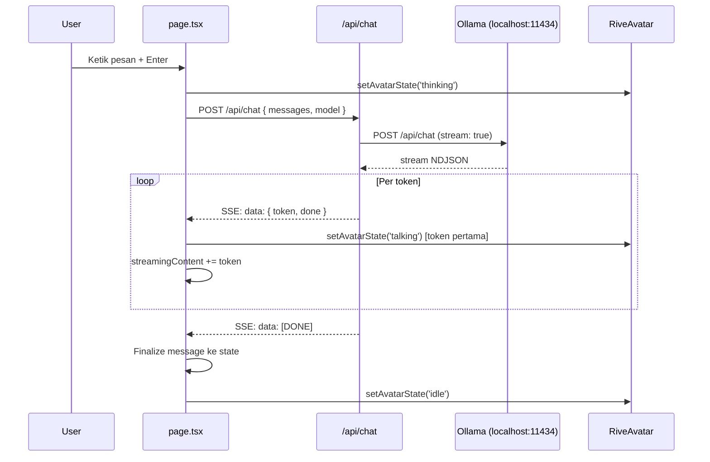

# chatbot-avatar

Chatbot lokal berbasis Next.js dengan avatar animasi Rive, streaming response dari Ollama. Tidak perlu internet, semua jalan di local.

---

## Daftar Isi

- [Tech Stack](#tech-stack)
- [Struktur Project](#struktur-project)
- [Quick Start](#quick-start)
- [Cara Kerja](#cara-kerja)
- [Komponen](#komponen)
- [API](#api)
- [Avatar & Rive](#avatar--rive)
- [Kustomisasi](#kustomisasi)
- [Troubleshooting](#troubleshooting)

---

## Tech Stack

| Teknologi              | Versi  | Fungsi                           |
| ---------------------- | ------ | -------------------------------- |
| Next.js                | 14.2.5 | Framework (App Router)           |
| React                  | 18     | UI                               |
| TypeScript             | 5      | Type safety                      |
| Tailwind CSS           | 3.4    | Styling                          |
| @rive-app/react-canvas | 4.12.3 | Render avatar animasi            |
| Ollama                 | —      | LLM lokal (llama3, mistral, dll) |

---

## Struktur Project

```
chatbot-avatar/
├── app/
│   ├── api/
│   │   └── chat/
│   │       └── route.ts        # API route — proxy ke Ollama, streaming SSE
│   ├── globals.css              # Global styles, font, animasi custom
│   ├── layout.tsx               # Root layout
│   └── page.tsx                 # Halaman utama — chat UI + state management
│
├── components/
│   └── avatar/
│       ├── AvatarContainer.tsx  # Wrapper dengan dynamic import (no SSR)
│       └── RiveAvatar.tsx       # Render Rive + kontrol state machine
│
├── lib/
│   └── types.ts                 # Type definitions: Message, AvatarState
│
├── public/
│   └── avatar.rev               # File animasi Rive
│
├── next.config.js
├── tailwind.config.ts
├── tsconfig.json
└── package.json
```

---

## Quick Start

### 1. Install dependencies

```bash
npm install
```

### 2. Pastikan Ollama berjalan

Download Ollama dari [ollama.ai](https://ollama.ai), lalu:

```bash
# Jalankan Ollama server
ollama serve

# Pull model yang mau dipakai (pilih salah satu)
ollama pull llama3
ollama pull llama3.2
ollama pull mistral
ollama pull gemma2
ollama pull phi3
ollama pull qwen2.5
```

### 3. Jalankan dev server

```bash
npm run dev
```

Buka [http://localhost:3000](http://localhost:3000).

---

## Cara Kerja

### Alur pengiriman pesan



### Avatar states

```
User kirim pesan
      │
      ▼
  [ thinking ]  ──── Ollama sedang proses
      │
      │  Token pertama tiba
      ▼
  [ talking ]   ──── Streaming berlangsung, teks muncul bertahap
      │
      │  Stream selesai / [DONE]
      ▼
   [ idle ]     ──── Menunggu input berikutnya
```

### Streaming SSE

Ollama mengembalikan NDJSON (newline-delimited JSON). API route membaca stream tersebut dan mengkonversinya ke format SSE (`text/event-stream`) agar bisa dikonsumsi langsung oleh browser:

```
Ollama NDJSON:
{"message":{"role":"assistant","content":"Halo"},"done":false}
{"message":{"role":"assistant","content":"!"},"done":true}

↓ Dikonversi oleh /api/chat

SSE ke browser:
data: {"token":"Halo","done":false}

data: {"token":"!","done":false}

data: [DONE]
```

---

## Komponen

### `app/page.tsx`

Halaman utama. Mengelola semua state aplikasi.

**State yang dikelola:**

| State              | Tipe             | Default      | Keterangan                               |
| ------------------ | ---------------- | ------------ | ---------------------------------------- |
| `messages`         | `Message[]`      | `[greeting]` | History percakapan                       |
| `input`            | `string`         | `''`         | Isi textarea                             |
| `avatarState`      | `AvatarState`    | `'idle'`     | State avatar saat ini                    |
| `isLoading`        | `boolean`        | `false`      | Sedang menunggu/streaming                |
| `model`            | `string`         | `'llama3'`   | Model Ollama yang dipilih                |
| `streamingContent` | `string`         | `''`         | Teks yang sedang di-stream (belum final) |
| `error`            | `string \| null` | `null`       | Pesan error jika ada                     |

**Fungsi utama:**

```typescript
// Kirim pesan ke API, handle SSE stream
const sendMessage = useCallback(async () => { ... }, [input, isLoading, messages, model])

// Stop streaming paksa
const handleStop = () => { abortRef.current?.abort() ... }
```

**Fitur UI:**

- Auto-resize textarea (max 140px)
- Auto-scroll ke bawah saat ada pesan baru
- Tombol Stop saat loading
- Waveform bars animasi saat avatar `talking`
- Streaming text dengan cursor berkedip
- Error state dengan pesan deskriptif

---

### `components/avatar/AvatarContainer.tsx`

Wrapper tipis di atas `RiveAvatar`. Fungsinya dua:

1. **Dynamic import dengan `ssr: false`** — Rive membutuhkan `canvas` di DOM, tidak bisa dirender di server. Ini mencegah hydration error di Next.js App Router.
2. **State label pill** — Badge kecil di bawah avatar yang menampilkan status terkini.

```typescript
const RiveAvatar = dynamic(() => import('./RiveAvatar'), {
  ssr: false,
  loading: () => <LoadingPlaceholder />,
})
```

---

### `components/avatar/RiveAvatar.tsx`

Komponen inti yang mengelola Rive runtime.

**Konfigurasi Rive:**

```typescript
const { RiveComponent, rive } = useRive({
  src: "/avatar.rev",
  artboard: "Avatar",
  stateMachines: "State Machine 1",
  autoplay: true,
  layout: new Layout({ fit: Fit.Contain, alignment: Alignment.Center }),
});
```

**State machine inputs yang dicoba:**

```typescript
const talkInput = useStateMachineInput(rive, "State Machine 1", "talk");
const thinkInput = useStateMachineInput(rive, "State Machine 1", "think");
const idleInput = useStateMachineInput(rive, "State Machine 1", "idle");
```

**Logika per state:**

| `AvatarState` | Input di-set                    | Fallback animation            |
| ------------- | ------------------------------- | ----------------------------- |
| `'idle'`      | `idle = true`, lainnya `false`  | Play animasi pertama yang ada |
| `'thinking'`  | `think = true`, lainnya `false` | `rive.play('think')`          |
| `'talking'`   | `talk = true`, lainnya `false`  | `rive.play('Mouth Shapes')`   |

**Glow effect per state:**

| State      | Warna glow      | CSS              |
| ---------- | --------------- | ---------------- |
| `idle`     | Putih tipis     | `bg-white/5`     |
| `thinking` | Biru            | `bg-blue-500/15` |
| `talking`  | Oranye (accent) | `bg-accent/20`   |

---

### `app/api/chat/route.ts`

API route yang menjadi proxy antara browser dan Ollama.

**Endpoint:** `POST /api/chat`

**Request body:**

```json
{
  "messages": [{ "role": "user", "content": "Halo!" }],
  "model": "llama3"
}
```

**Response:** SSE stream (`text/event-stream`)

```
data: {"token":"Halo","done":false}

data: {"token":"!","done":false}

data: [DONE]
```

**Error responses:**

| Status | Kondisi                     | Pesan                                                              |
| ------ | --------------------------- | ------------------------------------------------------------------ |
| `500`  | Ollama error                | `Ollama error: {status} {statusText}`                              |
| `503`  | Ollama tidak bisa dihubungi | `Cannot connect to Ollama. Run: ollama serve && ollama run llama3` |

---

### `lib/types.ts`

Type definitions yang dipakai di seluruh project.

```typescript
export interface Message {
  id: string;
  role: "user" | "assistant";
  content: string;
  createdAt: Date;
}

export type AvatarState = "idle" | "talking" | "thinking";
```

---

## API

### `POST /api/chat`

Proxy ke Ollama dengan konversi NDJSON → SSE.

**Headers request:**

```
Content-Type: application/json
```

**Headers response:**

```
Content-Type: text/event-stream
Cache-Control: no-cache
Connection: keep-alive
```

**Contoh fetch dari client:**

```typescript
const res = await fetch("/api/chat", {
  method: "POST",
  headers: { "Content-Type": "application/json" },
  body: JSON.stringify({ messages, model }),
  signal: abortController.signal, // untuk bisa di-cancel
});

const reader = res.body!.getReader();
// baca SSE stream...
```

---

## Avatar & Rive

### File `.rev`

File `public/avatar.rev` dibaca saat aplikasi dimuat. Berdasarkan inspeksi file:

| Property      | Nilai                                                       |
| ------------- | ----------------------------------------------------------- |
| Artboard      | `Avatar`                                                    |
| State Machine | `State Machine 1`                                           |
| Animasi       | `Mouth Shapes` (dan lainnya)                                |
| Parts         | `Face`, `Mouth`, `L Eye`, `R Eye`, `Body`, `hair`, `tongue` |

### Mengganti file avatar

1. Letakkan file `.rev` baru di `public/`
2. Buka `components/avatar/RiveAvatar.tsx`
3. Update konfigurasi:

```typescript
const { RiveComponent, rive } = useRive({
  src: '/nama-file-baru.rev',   // ganti ini
  artboard: 'NamaArtboard',     // sesuaikan dengan Rive editor
  stateMachines: 'State Machine 1',  // sesuaikan
  ...
})
```

### Menyesuaikan nama input state machine

Nama input (`talk`, `think`, `idle`) harus sesuai dengan yang ada di Rive editor. Cara cek:

1. Buka file `.rev` di [Rive editor](https://rive.app)
2. Klik tab **State Machine**
3. Lihat daftar **Inputs** di panel kiri

Kalau namanya berbeda, update di `RiveAvatar.tsx`:

```typescript
// Sesuaikan nama string di sini
const talkInput = useStateMachineInput(
  rive,
  "State Machine 1",
  "NAMA_INPUT_TALK",
);
const thinkInput = useStateMachineInput(
  rive,
  "State Machine 1",
  "NAMA_INPUT_THINK",
);
const idleInput = useStateMachineInput(
  rive,
  "State Machine 1",
  "NAMA_INPUT_IDLE",
);
```

---

## Kustomisasi

### Mengganti model default

Di `app/page.tsx`:

```typescript
const [model, setModel] = useState("llama3"); // ganti ke model yang diinginkan
```

### Menambah model ke dropdown

Di `app/page.tsx`:

```typescript
const MODELS = ["llama3", "llama3.2", "mistral", "gemma2", "phi3", "qwen2.5"];
// tambahkan nama model lain di sini
```

### Mengganti warna accent

Di `tailwind.config.ts`:

```typescript
colors: {
  accent: {
    DEFAULT: '#ff6b35',   // ganti warna utama
    soft: '#ff8c5a',
    glow: 'rgba(255,107,53,0.18)',
  },
}
```

### Menambah system prompt

Di `app/api/chat/route.ts`, tambahkan system message di awal array:

```typescript
const messagesWithSystem = [
  {
    role: "system",
    content:
      "Kamu adalah asisten yang ramah dan menjawab dalam bahasa Indonesia.",
  },
  ...messages,
];

body: JSON.stringify({ model, messages: messagesWithSystem, stream: true });
```

### Mengubah batas panjang streaming

Di `app/page.tsx`, saat ini tidak ada batasan panjang. Untuk membatasi input ke Ollama:

```typescript
// Di dalam sendMessage(), sebelum fetch:
const MAX_HISTORY = 10;
const trimmedMessages = nextMessages.slice(-MAX_HISTORY);
body: JSON.stringify({ messages: trimmedMessages, model });
```

---

## Troubleshooting

### Avatar tidak beranimasi

**Kemungkinan penyebab:**

- Nama artboard atau state machine di `.riv` berbeda
- Nama input (`talk`, `think`, `idle`) tidak ada di state machine

**Solusi:** Buka Rive editor, cek nama yang tepat, update `RiveAvatar.tsx`.

---

### Error: `Cannot connect to Ollama`

Pastikan Ollama sudah berjalan:

```bash
ollama serve
```

Kalau sudah berjalan tapi masih error, cek apakah port 11434 aktif:

```bash
curl http://localhost:11434/api/tags
```

---

### Error: `model not found`

Model belum di-pull. Jalankan:

```bash
ollama pull llama3
```

Ganti `llama3` dengan model yang dipilih di UI.

---

### Canvas error / hydration mismatch

Ini terjadi kalau `RiveAvatar` tidak di-load dengan `ssr: false`. Pastikan `AvatarContainer.tsx` tetap menggunakan:

```typescript
const RiveAvatar = dynamic(() => import("./RiveAvatar"), { ssr: false });
```

Jangan import `RiveAvatar` langsung tanpa `dynamic`.

---

### Streaming berhenti di tengah jalan

Kemungkinan koneksi ke Ollama terputus. Coba:

1. Klik tombol Stop (■)
2. Kirim ulang pesan
3. Kalau sering terjadi, cek resource (RAM) yang dipakai Ollama
